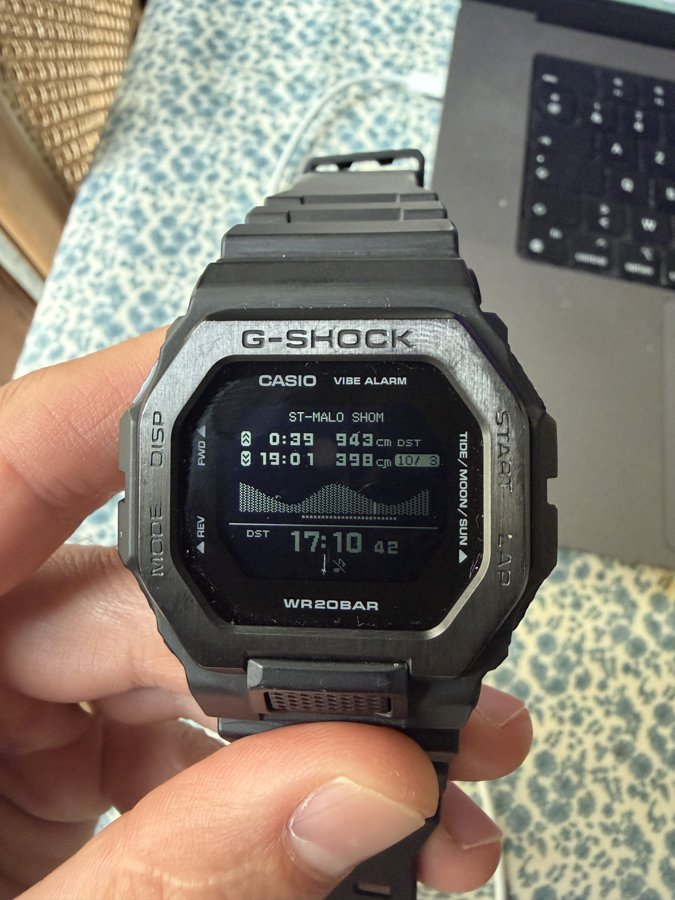
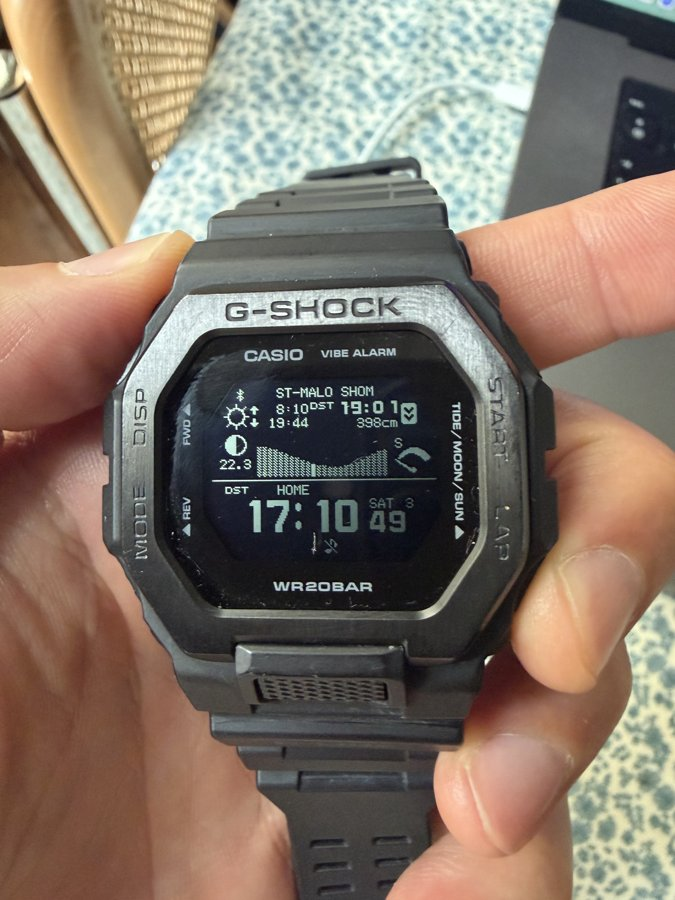

# Des marées précises sur une Casio G-Shock GBX-100

*[English version](README.md)*

Envoyer à une **Casio G-Shock GBX-100** (module 3482) des constantes de marée calculées à partir des **mesures officielles d'un marégraphe**, ici le SHOM pour Saint-Malo, à la place des données approximatives de l'appli CASIO WATCHES. La montre affiche ensuite des marées exactes à la minute près, **hors connexion**, avec son écran d'origine (graphe, PM/BM, lune, soleil). Ni le firmware ni la montre ne sont modifiés.

<p align="center">
  
  
</p>

<p align="center"><em>La montre le 3 octobre 2026 après l'envoi. Elle affiche une basse mer à 19:01 (398 cm) et une pleine mer à 0:39 (943 cm). L'annuaire SHOM donne 19:00 (4,00 m) et 00:40 (9,37 m). La version calée sur les mesures du marégraphe, au lieu de l'annuaire, donnait 19:13.</em></p>

| Saint-Malo | Écart moyen sur l'heure des PM/BM | Écart max |
|---|---|---|
| Données Casio d'origine (4 ondes) | ~30 min | 1 h 40 |
| Nos constantes (60 ondes, mesures SHOM) | ~3 min | 15 min |
| Version alignée sur l'annuaire SHOM, vérifiée sur la montre | ≤ 1 min | — |

## Le problème

Pour Saint-Malo, l'appli Casio n'envoie que **4 ondes harmoniques** (M2, S2, K1, O1, plus deux petites ondes de petits fonds). Il manque notamment N2 (0,71 m), K2 (0,41 m), M4 et MS4, ce qui est énorme pour l'un des plus grands marnages d'Europe. Résultat : des heures de pleine mer fausses de 30 minutes en moyenne, et parfois de plus d'une heure et demie.

Or le firmware de la montre **sait calculer une marée à 60 ondes** : l'appli s'en sert pour d'autres ports (Japon, États-Unis, une partie de la France). Il suffit de lui fournir un jeu de 60 constantes correct.

## Démarche expérimentale

Nous avons procédé par hypothèses successives, chacune vérifiée par une source indépendante avant de passer à la suivante. Nous ne sommes intervenus sur la montre qu'une fois le format confirmé, en commençant par une connexion en lecture seule.

**1. Lire ce que contient l'appli (analyse statique).** L'APK de CASIO WATCHES contient en clair les bases de ports de marée : environ 3 300 ports, dont 844 à 4 ondes et 2 492 à 60 ondes, avec leurs constantes harmoniques. On voit ainsi que la montre reçoit des constantes et fait le calcul elle-même. L'ordre des 60 colonnes, non documenté, a été retrouvé en reconnaissant les ondes principales de quelques ports connus.

**2. Quantifier le problème avant de toucher à la montre.** Nous avons téléchargé 7 ans de mesures horaires du marégraphe SHOM de Saint-Malo, fait une analyse harmonique sur 2019-2024, puis simulé sur 2025 (données non utilisées pour l'ajustement) le modèle Casio à 4 ondes et notre modèle à 60 ondes. Le gain attendu était connu avant le premier octet envoyé.

**3. Comprendre le chemin des données (décompilation, pour l'interopérabilité).** La partie Flutter (Dart compilé) a été décompilée avec `blutter`, la partie Android native avec `jadx`. Nous avons ainsi trouvé que le code Java construit un bloc binaire de 1 009 octets avec les 60 amplitudes et phases, l'envoie par un transfert Bluetooth en gros volume, puis écrit un petit enregistrement de réglages.

**4. Établir une vérité terrain (capture Bluetooth).** Nous avons capturé avec PacketLogger l'appli iOS officielle envoyant un port français à 60 ondes (La Rochelle). Notre générateur reproduit le bloc capturé **à l'octet près**, ce qui a confirmé les unités, les conventions et les valeurs manquantes (règle d'heure d'été).

**5. Tester par étapes sur la montre :** une connexion en lecture seule depuis un Mac, puis l'envoi de notre bloc, puis la vérification visuelle sur la montre face à nos prédictions et à l'annuaire officiel.

**6. Diagnostiquer les échecs.** Quand la montre s'est mise à refuser les transferts (« occupée »), une seconde capture de l'appli a montré la poignée de main complète qu'elle fait avant chaque transfert. Le script la reproduit désormais.

### Hypothèses validées ou réfutées

| Hypothèse | Résultat | Preuve |
|---|---|---|
| La montre calcule elle-même les marées à partir de paramètres | ✅ Validée | Constantes harmoniques dans l'APK ; affichage hors connexion |
| L'imprécision vient du modèle Casio, pas de la montre | ✅ Validée | Saint-Malo n'a que 4 ondes ; simulation : ~30 min d'erreur moyenne |
| Le firmware sait calculer avec 60 ondes | ✅ Validée | Ports à 60 ondes dans l'appli ; notre bloc affiché correctement |
| L'appli n'envoie qu'un numéro de port (la base serait dans la montre) | ❌ Réfutée | Code Java + capture : le bloc complet de constantes est transmis |
| Unités : cm et degrés ; phases en UTC ; longitude Ouest positive | ✅ Validée | Bloc capturé reproduit à l'octet près ; heures justes sur la montre |
| Les phases des ports à 4 ondes sont en UTC+1 | ✅ Validée | Décalage constant d'environ 30° (une heure de M2) avec notre analyse et entre ports voisins des deux listes |
| Un client tiers peut écrire dans la montre sans appairage | ✅ Validée | Connexion et envoi réussis depuis un Mac |
| La montre recharge les données à chaque envoi | ❌ Réfutée | Elle ne recharge que si le numéro de port change |
| La montre accepte un transfert à tout moment | ❌ Réfutée | Elle refuse en mode marée, et sans la poignée de main de l'appli |
| L'annuaire officiel colle exactement aux mesures | ❌ Réfutée (à Saint-Malo) | L'annuaire est ~12 min plus tôt que notre modèle ; la marée mesurée se situe entre les deux |

Le détail du protocole est dans [docs/PROTOCOLE.md](docs/PROTOCOLE.md).

## D'autres montres que la GBX-100 ?

Testé **uniquement sur une GBX-100 (module 3482)**. Indices pour d'autres modèles, **non testés** :
- Dans le code de l'appli, le module **3586** passe par le même chemin « multi-emplacements » que le 3482. Il est probable qu'il accepte le même format, mais nous ne l'avons pas vérifié.
- L'appli contient aussi des tables de correspondance pour d'autres montres à graphe de marée (modules 3452 et 5623, de la famille Rangeman et Frogman). Elles semblent utiliser d'autres formats et d'autres échanges. L'approche (analyse de l'APK, puis capture, puis reproduction) devrait s'appliquer, mais le code devra être adapté.
- Le côté Android natif de la version 4.6.0 n'active le transfert de marée que pour la GBX-100.

Si vous essayez sur un autre modèle, commencez par `scripts/lecture_montre.py` (lecture seule), et faites une capture Bluetooth de l'appli officielle pour comparer.

## Autres sources de données que le SHOM

Nous avons utilisé le **SHOM** parce que la montre sert à Saint-Malo. La méthode est générique : n'importe quelle série de hauteurs d'eau d'au moins un an, ou des constantes harmoniques publiées, convient. Selon la région :

| Région | Organisme | Ce qu'on y trouve |
|---|---|---|
| France (métropole et outre-mer) | **SHOM** — data.shom.fr (REFMAR) | Mesures de marégraphes, en licence ouverte |
| États-Unis | **NOAA CO-OPS** — tidesandcurrents.noaa.gov | Mesures, et **constantes harmoniques publiées** (phase « GMT ») : aucune analyse à faire |
| Royaume-Uni | **National Tidal and Sea Level Facility / BODC** | Mesures du réseau britannique |
| Canada | **Pêches et Océans Canada / SHC** | Mesures, prédictions |
| Allemagne, Pays-Bas, Belgique | **BSH**, **Rijkswaterstaat**, **Afdeling Kust** | Mesures et prédictions nationales |
| Espagne, Portugal | **Puertos del Estado**, **Instituto Hidrográfico** | Mesures des ports |
| Australie, Nouvelle-Zélande | **Bureau of Meteorology**, **LINZ** | Mesures, prédictions |
| Monde | **UHSLC**, **GESLA** | Séries de marégraphes du monde entier |
| Partout, même sans marégraphe | Modèles globaux **FES2022** (AVISO), **TPXO** | Constantes en tout point ; moins précis près des côtes et dans les estuaires |

À vérifier quelle que soit la source :
- les phases doivent être en **référence UTC/Greenwich** (et non en heure locale), et les amplitudes en **cm** ;
- les noms d'ondes doivent être mis en correspondance avec l'ordre Casio (fait dans `constantes_casio.py`) ;
- le zéro des hauteurs (zéro hydrographique local, ou niveau moyen) détermine les hauteurs affichées ;
- pour coller à l'annuaire officiel local plutôt qu'aux mesures, un décalage peut être calé comme dans `aligne_shom.py`.

## Utilisation

Prérequis : Python 3.10 ou plus et un ordinateur avec Bluetooth LE. Testé sur macOS 26 (Apple Silicon). Les scripts sont commentés en français.

```bash
python3 -m venv .venv && source .venv/bin/activate
pip install -r requirements.txt
```

Toutes les commandes se lancent depuis la racine du dépôt.

### Envoyer les marées de Saint-Malo (constantes fournies)

1. Coupez le Bluetooth du téléphone appairé à la montre, sinon il prendra la connexion.
2. Mettez la montre sur l'**écran de l'heure**. En mode marée, elle refuse le transfert.
3. Lancez la commande, puis appuyez sur le bouton de connexion de la montre :

```bash
python scripts/envoi_maree.py data/saint_malo_3482_shom.bin
```

La montre doit afficher « ST-MALO SHOM » en mode marée. Utilisez `data/saint_malo_3482.bin` pour la version calée sur les mesures plutôt que sur l'annuaire. Le script met aussi la montre à l'heure de l'ordinateur.

Pour lire seulement les réglages de marée, sans rien écrire :

```bash
python scripts/lecture_montre.py
```

### Recalculer les constantes, ou les calculer pour un autre port

```bash
python scripts/telecharger_refmar.py 410 2019 2025 data/saint_malo_horaire.csv
python scripts/analyse.py
python scripts/constantes_casio.py
python scripts/gen_blob.py
python scripts/aligne_shom.py
python scripts/previsions.py 2026-10-03
```

Les étapes :
- `telecharger_refmar.py` télécharge les mesures SHOM (410 = Saint-Malo).
- `analyse.py` fait l'analyse harmonique et la compare au modèle Casio.
- `constantes_casio.py` produit les constantes au format Casio. Il accepte le nom, la latitude et la longitude en arguments.
- `gen_blob.py` produit le bloc de 1009 octets. Le nom affiché fait 18 caractères au maximum.
- `aligne_shom.py` est optionnel : il applique le décalage vers l'annuaire et vérifie le résultat.
- `previsions.py` affiche les PM/BM prévues pour comparer avec la montre.

Bonus : `parse_pklg.py` décode une capture Bluetooth PacketLogger (macOS/iOS) en liste d'opérations GATT.

## Limites et précautions

- **Projet personnel, non affilié à Casio ni au SHOM.** À utiliser à vos risques. Le pire cas rencontré est réversible : resélectionner un port dans l'appli CASIO WATCHES remet les données d'origine.
- **L'appli Casio peut écraser les données.** À chaque reconnexion, elle renvoie ses propres données pour le numéro de port enregistré. Le script utilise un numéro inconnu de l'appli (9999 ou 9998). La persistance sur plusieurs jours reste à confirmer.
- Ce n'est **pas un instrument de navigation**. Les prédictions n'incluent pas la météo (surcotes de 10 à 20 cm courantes). Référez-vous aux documents officiels.

## Sources, licences et crédits

- **Mesures marégraphiques :** © SHOM, réseau REFMAR, [data.shom.fr](https://data.shom.fr), [Licence Ouverte Etalab 2.0](https://www.etalab.gouv.fr/licence-ouverte-open-licence/). Elles ne sont pas incluses : `telecharger_refmar.py` les récupère. Les constantes fournies dans `data/` en sont dérivées.
- **Protocole :** déterminé par analyse de l'appli CASIO WATCHES 4.6.0, à seule fin d'interopérabilité (directive 2009/24/CE, art. 6), et confirmé par des captures Bluetooth. Ce dépôt ne contient ni code ni fichiers de Casio ; seules les 6 constantes Casio de Saint-Malo sont citées dans `analyse.py` pour la comparaison. Le travail de reverse-engineering de [Gadgetbridge](https://gadgetbridge.org) sur les montres Casio a servi de point de départ.
- **Outils :** [utide](https://github.com/wesleybowman/UTide), [bleak](https://github.com/hbldh/bleak), [blutter](https://github.com/worawit/blutter), [jadx](https://github.com/skylot/jadx), PacketLogger (Apple).
- **Code :** licence MIT (voir [LICENSE](LICENSE)).
