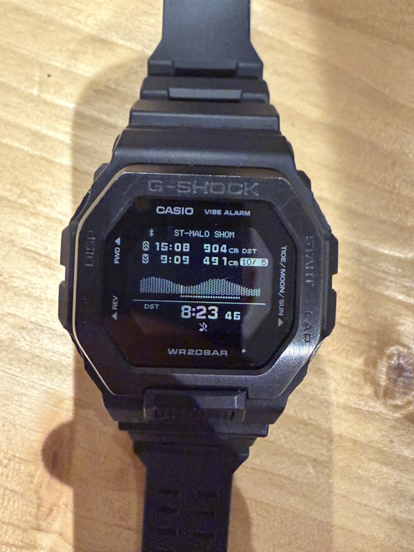
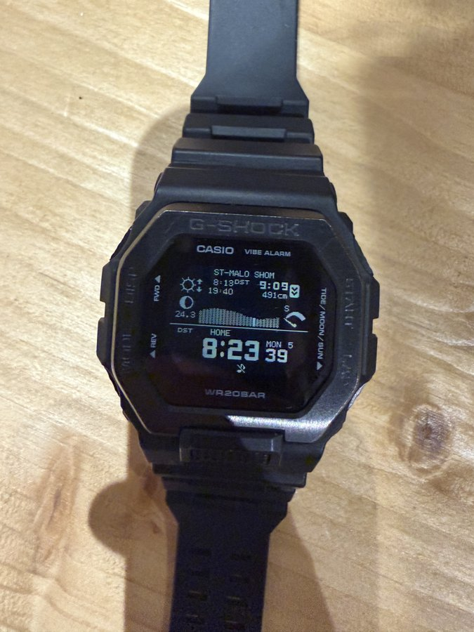
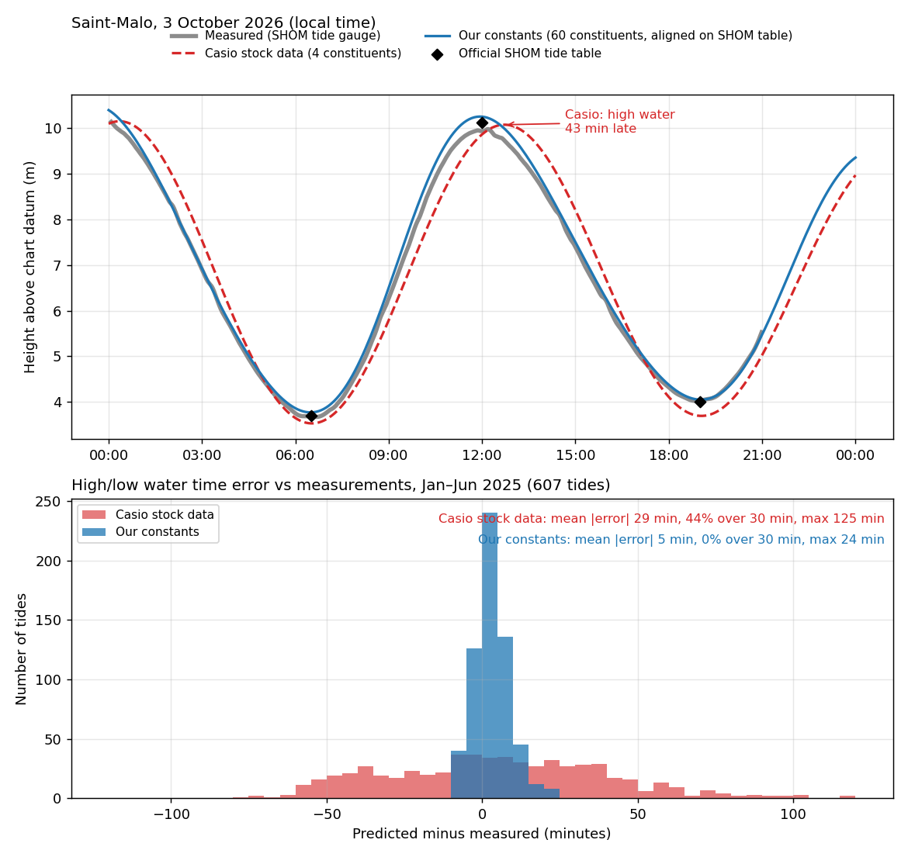

# Des marées précises sur une Casio G-Shock GBX-100

*[English version](README.md)*

Envoyer à une **Casio G-Shock GBX-100** (module 3482) des constantes de marée calculées à partir des **mesures officielles d'un marégraphe**, ici le SHOM pour Saint-Malo, envoyées comme un **port personnalisé** baptisé « ST-MALO SHOM », à la place des données approximatives de l'appli CASIO WATCHES. La montre affiche ensuite des marées justes à quelques minutes près, **hors connexion**, avec son écran d'origine (graphe, PM/BM, lune, soleil). Ni le firmware ni la montre ne sont modifiés. On peut créer son propre port, n'importe où et avec le nom de son choix ([comment](#créer-son-propre-port-nimporte-quel-lieu-nimporte-quel-nom)).

<p align="center">
  
  
</p>

<p align="center"><em>La montre le 3 octobre 2026 après l'envoi. Elle affiche une basse mer à 19:01 (398 cm) et une pleine mer à 0:39 (943 cm). L'annuaire SHOM donne 19:00 (4,00 m) et 00:40 (9,37 m). La version calée sur les mesures du marégraphe, au lieu de l'annuaire, donnait 19:13.</em></p>

<p align="center">
  
  
</p>

<p align="center"><em>Deux jours plus tard (5 octobre 2026), après la reconnexion de la montre au téléphone, les données sont toujours là. Basse mer à 9:09 (491 cm) et pleine mer à 15:08 (904 cm), contre 09:06 (4,90 m) et 15:10 (9,08 m) dans l'annuaire SHOM.</em></p>

| Saint-Malo, écart sur l'heure des PM/BM | Moyen | Max |
|---|---|---|
| Données Casio d'origine (4 ondes), face aux mesures du marégraphe (2025) | 29 min | 2 h 05 |
| Nos constantes (60 ondes, calées sur les mesures), face aux mesures (2025) | 5 min | 24 min |
| Nos constantes recalées sur l'annuaire officiel, face à l'annuaire (août-octobre 2026, 309 marées non utilisées pour le calage) | 3,4 min | 14 min |

## Pourquoi les données Casio d'origine ne sont pas exploitables (au moins à Saint-Malo)



*En haut : la marée du 3 octobre 2026. Le modèle Casio d'origine tombe à peu près juste sur les basses mers, mais met la pleine mer **43 minutes trop tard**. En bas : l'erreur sur l'heure de 607 pleines et basses mers (janvier à juin 2025), face aux **mesures réelles** du marégraphe SHOM. Ces mesures n'ont pas servi à ajuster nos constantes. Le graphique se reproduit avec `scripts/figure_ecart.py`.*

| Face aux mesures, janvier-juin 2025 | Données Casio d'origine | Nos constantes |
|---|---|---|
| Erreur moyenne sur l'heure des PM/BM | **29 min** | 5 min |
| Marées décalées de plus de 30 min | **44 %** | 0 % |
| Pire cas | **2 h 05** | 24 min |

Pourquoi c'est inutilisable pour naviguer ici :
- **L'erreur est grande et imprévisible.** Elle va d'environ −80 à +120 minutes selon le jour et le moment de la marée. Aucune correction fixe « de tête » ne peut la compenser : le même jour, la basse mer peut être juste et la pleine mer avoir 43 minutes de retard.
- **Une erreur d'heure devient une erreur de hauteur.** À Saint-Malo, le marnage atteint 12 à 13 m en vives-eaux. À mi-marée, l'eau monte ou descend jusqu'à environ 3 m par heure (règle des douzièmes) : 30 minutes d'écart, c'est parfois plus d'un mètre d'eau. Sur 2025, l'erreur de hauteur du modèle Casio était de 50 cm en moyenne, et jusqu'à 1,60 m.
- **Ce qui compte se joue à la minute :** ouverture des écluses et accès au port calés sur la pleine mer, mouillages qui assèchent, seuils et passages peu profonds, renverse des courants très forts du golfe de Saint-Malo.

La montre n'y est pour rien. C'est le jeu de données à 4 ondes qui pose problème : à Saint-Malo, la courbe est fortement déformée par les ondes de petits fonds (M4, MS4, MN4…) et modulée par N2 et K2 entre vives-eaux et mortes-eaux, et Casio n'envoie aucune de ces ondes. D'autres ports peuvent être corrects. Ceux à grand marnage, ou à marée très peu sinusoïdale, risquent de présenter le même défaut.

## Le problème

Pour Saint-Malo, l'appli Casio n'envoie que **4 ondes harmoniques** (M2, S2, K1, O1, plus deux petites ondes de petits fonds). Il manque notamment N2 (0,71 m), K2 (0,41 m), M4 et MS4, ce qui est énorme pour l'un des plus grands marnages d'Europe. Résultat : des heures de pleine mer fausses de 30 minutes en moyenne, et parfois de plus d'une heure et demie.

Or le firmware de la montre **sait calculer une marée à 60 ondes** : l'appli s'en sert pour d'autres ports (Japon, États-Unis, une partie de la France). Il suffit de lui fournir un jeu de 60 constantes correct.

## Démarche expérimentale

Nous avons procédé par hypothèses successives, chacune vérifiée par une source indépendante avant de passer à la suivante. Nous ne sommes intervenus sur la montre qu'une fois le format confirmé, en commençant par une connexion en lecture seule.

**1. Lire ce que contient l'appli (analyse statique).** L'APK de CASIO WATCHES contient en clair les bases de ports de marée : environ 3 300 ports, dont 844 à 4 ondes et 2 492 à 60 ondes, avec leurs constantes harmoniques. On voit ainsi que la montre reçoit des constantes et fait le calcul elle-même. L'ordre des 60 colonnes, non documenté, a été retrouvé en reconnaissant les ondes principales de quelques ports connus.

**2. Quantifier le problème avant de toucher à la montre.** Nous avons téléchargé 7 ans de mesures horaires du marégraphe SHOM de Saint-Malo, fait une analyse harmonique sur 2019-2024, puis simulé sur 2025 (données non utilisées pour l'ajustement) le modèle Casio à 4 ondes et notre modèle à 60 ondes. Le gain attendu était connu avant le premier octet envoyé.

**3. Comprendre le chemin des données (décompilation, pour l'interopérabilité).** La partie Flutter (Dart compilé) a été décompilée avec `blutter`, la partie Android native avec `jadx`. Nous avons ainsi trouvé que le code Java construit un bloc binaire de 1 009 octets avec les 60 amplitudes et phases, l'envoie par un transfert Bluetooth en gros volume, puis écrit un petit enregistrement de réglages.

**4. Établir une vérité terrain (capture Bluetooth).** Nous avons capturé avec PacketLogger l'appli iOS officielle envoyant un port français à 60 ondes (La Rochelle). Notre générateur reproduit le bloc capturé **à l'octet près**, ce qui a confirmé les unités, les conventions et les valeurs manquantes (règle d'heure d'été).

**5. Tester par étapes sur la montre :** une connexion en lecture seule depuis un Mac, puis l'envoi de notre bloc, puis la vérification visuelle sur la montre face à nos prédictions et à l'annuaire officiel.

**6. Diagnostiquer les échecs.** Quand la montre s'est mise à refuser les transferts (« occupée »), une seconde capture de l'appli a montré la poignée de main complète qu'elle fait avant chaque transfert. Le script la reproduit désormais.

**7. Coller à l'annuaire officiel, et tirer la leçon d'une erreur.** Notre premier essai décalait toutes les constantes de 12 minutes, calées sur **trois jours de mortes-eaux**. Ces jours-là, la montre tombait à la minute ; cinq jours plus tard, en vives-eaux, elle avait 13 à 21 minutes d'avance. L'écart entre l'annuaire et le modèle calé sur les mesures n'est pas constant : environ 13 min en mortes-eaux, presque 0 en vives-eaux. Un décalage fixe ne peut pas le corriger. Nous l'avons remplacé par un vrai calage sur 9,5 mois de PM/BM de l'annuaire, validé sur des mois jamais utilisés, avec vives-eaux et mortes-eaux présentées séparément (voir [Coller à son annuaire officiel](#coller-à-son-annuaire-officiel)).

### Hypothèses validées ou réfutées

| Hypothèse | Résultat | Preuve |
|---|---|---|
| La montre calcule elle-même les marées à partir de paramètres | ✅ Validée | Constantes harmoniques dans l'APK ; affichage hors connexion |
| L'imprécision vient du modèle Casio, pas de la montre | ✅ Validée | Saint-Malo n'a que 4 ondes ; simulation : ~30 min d'erreur moyenne |
| Le firmware sait calculer avec 60 ondes | ✅ Validée | Ports à 60 ondes dans l'appli ; notre bloc affiché correctement |
| L'appli n'envoie qu'un numéro de port (la base serait dans la montre) | ❌ Réfutée | Code Java + capture : le bloc complet de constantes est transmis |
| Unités : cm et degrés ; phases en UTC ; longitude Ouest positive | ✅ Validée | Bloc capturé reproduit à l'octet près ; heures justes sur la montre |
| Les phases des ports à 4 ondes sont en UTC+1 | ✅ Validée | Décalage constant d'environ 30° (une heure de M2) avec notre analyse et entre ports voisins des deux listes |
| Un client tiers peut écrire dans la montre sans appairage | ✅ Validée | Connexion et envoi réussis depuis un Mac |
| La montre recharge les données à chaque envoi | ❌ Réfutée | Elle ne recharge que si le numéro de port change |
| La montre accepte un transfert à tout moment | ❌ Réfutée | Elle refuse en mode marée, et sans la poignée de main de l'appli |
| L'annuaire officiel colle exactement aux mesures | ❌ Réfutée (à Saint-Malo) | L'écart dépend de la marée : ~13 min en mortes-eaux, ~0 en vives-eaux |
| Un décalage horaire fixe suffit pour coller à l'annuaire | ❌ Réfutée | Calé sur 3 jours de mortes-eaux, il mettait la montre 13 à 21 min en avance en vives-eaux |
| Un calage sur une longue série de PM/BM officielles fonctionne | ✅ Validée | 3,4 min d'écart moyen sur des mois non utilisés, plus de biais en vives-eaux |
| Caler sur les hauteurs horaires officielles (toute la courbe) fait encore mieux | ❌ Réfutée (avec 7 mois de données) | 4,5 min au mieux sur les mêmes marées de validation, contre 3,4 min pour le calage sur les PM/BM |

Le détail du protocole est dans [docs/PROTOCOLE.md](docs/PROTOCOLE.md).

## D'autres montres que la GBX-100 ?

Testé **uniquement sur une GBX-100 (module 3482)**. Indices pour d'autres modèles, **non testés** :
- Dans le code de l'appli, le module **3586** passe par le même chemin « multi-emplacements » que le 3482. Il est probable qu'il accepte le même format, mais nous ne l'avons pas vérifié.
- L'appli contient aussi des tables de correspondance pour d'autres montres à graphe de marée (modules 3452 et 5623, de la famille Rangeman et Frogman). Elles semblent utiliser d'autres formats et d'autres échanges. L'approche (analyse de l'APK, puis capture, puis reproduction) devrait s'appliquer, mais le code devra être adapté.
- Le côté Android natif de la version 4.6.0 n'active le transfert de marée que pour la GBX-100.

Si vous essayez sur un autre modèle, commencez par `scripts/lecture_montre.py` (lecture seule), et faites une capture Bluetooth de l'appli officielle pour comparer.

## Autres sources de données que le SHOM

Nous avons utilisé le **SHOM** parce que la montre sert à Saint-Malo. La méthode est générique : n'importe quelle série de hauteurs d'eau d'au moins un an, ou des constantes harmoniques publiées, convient. Selon la région :

| Région | Organisme | Ce qu'on y trouve |
|---|---|---|
| France (métropole et outre-mer) | **SHOM** — data.shom.fr (REFMAR) | Mesures de marégraphes, en licence ouverte |
| États-Unis | **NOAA CO-OPS** — tidesandcurrents.noaa.gov | Mesures, et **constantes harmoniques publiées** (phase « GMT ») : aucune analyse à faire |
| Royaume-Uni | **National Tidal and Sea Level Facility / BODC** | Mesures du réseau britannique |
| Canada | **Pêches et Océans Canada / SHC** | Mesures, prédictions |
| Allemagne, Pays-Bas, Belgique | **BSH**, **Rijkswaterstaat**, **Afdeling Kust** | Mesures et prédictions nationales |
| Espagne, Portugal | **Puertos del Estado**, **Instituto Hidrográfico** | Mesures des ports |
| Australie, Nouvelle-Zélande | **Bureau of Meteorology**, **LINZ** | Mesures, prédictions |
| Monde | **UHSLC**, **GESLA** | Séries de marégraphes du monde entier |
| Partout, même sans marégraphe | Modèles globaux **FES2022** (AVISO), **TPXO** | Constantes en tout point ; moins précis près des côtes et dans les estuaires |

À vérifier quelle que soit la source :
- les phases doivent être en **référence UTC/Greenwich** (et non en heure locale), et les amplitudes en **cm** ;
- les noms d'ondes doivent être mis en correspondance avec l'ordre Casio (fait dans `constantes_casio.py`) ;
- le zéro des hauteurs (zéro hydrographique local, ou niveau moyen) détermine les hauteurs affichées ;
- pour coller à l'annuaire officiel local plutôt qu'aux mesures, calez sur ses PM/BM (voir [Coller à son annuaire officiel](#coller-à-son-annuaire-officiel)), pas avec un décalage fixe.

## Utilisation

Prérequis : Python 3.10 ou plus et un ordinateur avec Bluetooth LE. Testé sur macOS 26 (Apple Silicon). Les scripts sont commentés en français.

```bash
python3 -m venv .venv && source .venv/bin/activate
pip install -r requirements.txt
```

Toutes les commandes se lancent depuis la racine du dépôt.

### Envoyer les marées de Saint-Malo (constantes fournies)

1. Coupez le Bluetooth du téléphone appairé à la montre, sinon il prendra la connexion.
2. Mettez la montre sur l'**écran de l'heure**. En mode marée, elle refuse le transfert.
3. Lancez la commande, puis appuyez sur le bouton de connexion de la montre :

```bash
python scripts/envoi_maree.py data/saint_malo_3482.bin
```

La montre doit afficher « ST-MALO SHOM » en mode marée. Ce bloc est calé sur les mesures du marégraphe. Pour coller plutôt à votre annuaire officiel, voir [Coller à son annuaire officiel](#coller-à-son-annuaire-officiel). Le script met aussi la montre à l'heure de l'ordinateur.

Pour lire seulement les réglages de marée, sans rien écrire :

```bash
python scripts/lecture_montre.py
```

### Créer son propre port (n'importe quel lieu, n'importe quel nom)

« ST-MALO SHOM » n'est pas un port Casio : c'est un **port personnalisé**, que nous avons construit. Vous pouvez faire de même pour n'importe quel endroit où vous trouvez des données de marée, avec le nom de votre choix sur l'écran de marée.

1. **Récupérer des données.** Soit un CSV de hauteurs d'eau couvrant au moins un an, avec les colonnes `t` (date et heure UTC) et `h` (hauteur en mètres au-dessus du zéro des cartes), voir [`data/sample_tide_data.csv`](data/sample_tide_data.csv). Des valeurs horaires suffisent, et des prédictions officielles conviennent aussi bien que des mesures ; soit des constantes harmoniques publiées (NOAA par exemple). Dans ce second cas, écrivez directement `data/mon_port.json` au même format que `data/saint_malo_60.json` : `Z0` et `A` en mètres, phases `g` de Greenwich en degrés, noms d'ondes utide. Passez alors l'étape 2.
2. **Calculer les constantes :**
   ```bash
   python scripts/analyse.py data/mon_port.csv data/mon_port.json 47.27
   ```
   (le dernier nombre est la latitude)
3. **Convertir au format Casio :** nom, latitude, puis longitude (Est positif) :
   ```bash
   python scripts/constantes_casio.py data/mon_port.json data/mon_port_casio60.csv "MON PORT" 47.27 -2.21
   ```
4. **Générer le bloc** avec le **nom affiché sur la montre** :
   ```bash
   python scripts/gen_blob.py data/mon_port_casio60.csv data/mon_port.bin "PORNIC"
   ```
5. **L'envoyer** comme décrit plus haut :
   ```bash
   python scripts/envoi_maree.py data/mon_port.bin
   ```

À savoir :
- **Nom :** 18 octets au maximum. Seuls les majuscules, chiffres, espaces et tirets ont été testés (« ST-MALO SHOM »). Minuscules et accents : non testés.
- **Fuseau horaire :** passez votre décalage UTC (en heures, hors heure d'été) et un code de règle d'heure d'été en 4ᵉ et 5ᵉ arguments de `gen_blob.py`, par exemple `... "MON PORT" -8 2`. Par défaut : UTC+1 avec la règle 2 = heure d'été de l'Union européenne (France), seul code confirmé à ce jour. Les codes des autres régions (Amérique du Nord, etc.) ne sont pas encore connus ; une capture de l'appli officielle pendant qu'elle envoie un port de votre zone (voir `parse_pklg.py`) permettra de les trouver.
- **Un seul port personnalisé à la fois.** La montre n'a qu'un emplacement « APP » pour des constantes complètes. Changer de port, c'est renvoyer un bloc, ce qui prend une minute.

### Recalculer les constantes, ou les calculer pour un autre port

```bash
python scripts/telecharger_refmar.py 410 2019 2025 data/saint_malo_horaire.csv
python scripts/analyse.py
python scripts/constantes_casio.py
python scripts/gen_blob.py
python scripts/previsions.py 2026-10-03
```

Les étapes :
- `telecharger_refmar.py` télécharge les mesures SHOM (410 = Saint-Malo).
- `analyse.py` fait l'analyse harmonique et la compare au modèle Casio.
- `constantes_casio.py` produit les constantes au format Casio. Il accepte le nom, la latitude et la longitude en arguments.
- `gen_blob.py` produit le bloc de 1009 octets. Le nom affiché fait 18 caractères au maximum.
- `previsions.py` affiche les PM/BM prévues pour comparer avec la montre.
- `calage_extremes.py` recale les constantes sur des PM/BM officielles (voir [Coller à son annuaire officiel](#coller-à-son-annuaire-officiel)).
- `figure_ecart.py` produit le graphique de comparaison Casio / mesures / nos constantes.

Bonus : `parse_pklg.py` décode une capture Bluetooth PacketLogger (macOS/iOS) en liste d'opérations GATT.

### Coller à son annuaire officiel

Des constantes calées sur les **mesures** d'un marégraphe suivent l'eau réelle. Votre **annuaire officiel** (SHOM, NOAA, UKHO, CHS...) est calculé par l'organisme hydrographique avec son propre modèle, plus complet, et peut différer de quelques minutes, différemment en vives-eaux et en mortes-eaux. Si vous voulez que la montre affiche les mêmes heures que l'annuaire avec lequel vous naviguez, calez-la dessus :

1. **Récupérez les PM et BM officielles** de votre port sur une période aussi longue que possible : au moins quelques mois, idéalement un an. Enregistrez-les dans un CSV avec les colonnes `t` (date et heure, telles qu'imprimées dans l'annuaire), `type` (`HW` ou `LW`) et `h` (hauteur en mètres, même zéro que vos constantes). Vérifiez les conditions d'utilisation de l'annuaire : beaucoup sont libres de consultation mais pas de republication, gardez ce fichier pour vous.
2. **Lancez le calage**, en choisissant une date qui partage les données : les marées avant servent au calage, celles après seulement à vérifier le résultat.
   ```bash
   python scripts/calage_extremes.py data/mon_port.json mon_annuaire.csv data/mon_port_cale.json 48.64 Europe/Paris 2026-08-01
   ```
   (constantes de départ, annuaire, sortie, latitude, fuseau des heures de l'annuaire, date de partage)
3. **Lisez le rapport de validation.** Le script compare les constantes de départ et plusieurs versions recalées sur les marées mises de côté, avec le biais en vives-eaux et en mortes-eaux présenté séparément, et retient la meilleure. Ensuite seulement, il recale sur toutes les données.
4. Continuez comme d'habitude avec `constantes_casio.py`, `gen_blob.py` et `envoi_maree.py`, à partir du JSON recalé.

Le principe : à l'heure exacte d'une PM ou BM officielle, la courbe prédite doit être à plat et à la hauteur officielle. La courbe étant une somme d'ondes, ces deux conditions sont linéaires en fonction des constantes : c'est un simple problème de moindres carrés. Une pénalité retient la solution près des constantes de départ, pour éviter le sur-apprentissage ; sa force est choisie sur les marées de validation.

**Pourquoi caler sur les PM/BM plutôt que sur la courbe horaire ?** Nous avons aussi essayé de caler les 60 ondes sur les **hauteurs horaires** officielles (7 mois, janvier à juillet 2026), seules ou combinées aux PM/BM, avec validation sur les mêmes marées mises de côté. Le résultat est moins bon : 4,5 min au mieux contre 3,4 min, et jusqu'à 43 min sans forte pénalité. Deux raisons :
- séparer des ondes proches (S2/T2/R2, K1/P1, ondes annuelles) demande au moins un an de données, idéalement plusieurs ; avec 7 mois, le calcul les confond et dérape hors de la période de calage, sauf à le retenir si près des constantes de départ qu'il n'apporte presque rien ;
- la montre n'a que 60 ondes et ne peut pas reproduire exactement la courbe officielle. Caler toute la courbe répartit l'erreur sur toutes les heures, y compris à mi-marée, où l'eau monte ou descend jusqu'à 3 m par heure à Saint-Malo ; caler sur les PM/BM concentre l'effort là où ça compte.

Avec plusieurs années de hauteurs horaires officielles, la méthode par la courbe pourrait devenir compétitive, mais la limite des 60 ondes plafonne le gain.

Deux règles apprises à nos dépens :
- **Ne jamais valider sur les données qui ont servi au calage**, et ne jamais juger sur quelques jours : à Saint-Malo, l'écart entre l'annuaire et les mesures va d'environ 13 min en mortes-eaux à presque 0 en vives-eaux.
- **Présenter vives-eaux et mortes-eaux séparément.** Une moyenne peut masquer une grosse erreur sur l'une des deux.

À Saint-Malo, le calage sur 9,5 mois d'annuaire (janvier à mi-octobre 2026) a fait passer l'écart avec l'annuaire, sur des mois non utilisés, de 4,8 à 3,4 min en moyenne (max 22 → 14 min) et de 8,8 à 3,9 cm en hauteur, sans plus aucun biais en vives-eaux. Un petit biais d'environ 4 min subsiste en mortes-eaux : la courbe est très plate autour des PM et BM de mortes-eaux, si bien qu'une infime différence de forme déplace la minute exacte de l'extremum.

## Limites et précautions

- **Projet personnel, non affilié à Casio ni au SHOM.** À utiliser à vos risques. Le pire cas rencontré est réversible : resélectionner un port dans l'appli CASIO WATCHES remet les données d'origine.
- **À la reconnexion, l'appli Casio renvoie ses propres données pour les ports qu'elle connaît.** Le script utilise un numéro qu'elle ne connaît pas (9999 ou 9998), et ça fonctionne : les données envoyées ont survécu à la reconnexion de la montre au téléphone (vérifié deux jours après l'envoi, le 5 octobre 2026 : BM 9:09 contre 09:06 dans l'annuaire, PM 15:08 contre 15:10). En revanche, sélectionner un port dans l'appli les remplace.
- Ce n'est **pas un instrument de navigation**. Les prédictions n'incluent pas la météo (surcotes de 10 à 20 cm courantes). Référez-vous aux documents officiels.

## Sources, licences et crédits

- **Mesures marégraphiques :** © SHOM, réseau REFMAR, [data.shom.fr](https://data.shom.fr), [Licence Ouverte Etalab 2.0](https://www.etalab.gouv.fr/licence-ouverte-open-licence/). Elles ne sont pas incluses : `telecharger_refmar.py` les récupère. Les constantes fournies dans `data/` en sont dérivées.
- **Protocole :** déterminé par analyse de l'appli CASIO WATCHES 4.6.0, à seule fin d'interopérabilité (directive 2009/24/CE, art. 6), et confirmé par des captures Bluetooth. Ce dépôt ne contient ni code ni fichiers de Casio ; seules les 6 constantes Casio de Saint-Malo sont citées dans `analyse.py` pour la comparaison. Le travail de reverse-engineering de [Gadgetbridge](https://gadgetbridge.org) sur les montres Casio a servi de point de départ.
- **Outils :** [utide](https://github.com/wesleybowman/UTide), [bleak](https://github.com/hbldh/bleak), [blutter](https://github.com/worawit/blutter), [jadx](https://github.com/skylot/jadx), PacketLogger (Apple).
- **Code :** licence MIT (voir [LICENSE](LICENSE)).
